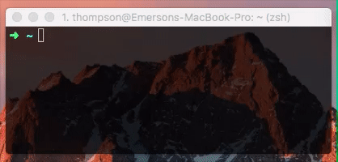

# moeda
> A foreign exchange rates and currency conversion using cli

<p align="center">
  
</p>

#### Info
The `moeda` use JSON API [Fixer.io](http://fixer.io/) for current and historical foreign exchange rates published by the European Central Bank.
The rates are updated daily around 4PM CET.

#### Install
```
$ npm install -g moeda
```

#### CLI
```
Usage
  $ moeda <amount> <currency>

Some currency
  [ usd, eur, gbp, brl... ]

Examples
  $ moeda 1 usd

Result
             Euro: 0.92
  Libra Esterlina: 0.82
   Real Brazilian: 3.15

  Conversion of USD 1
```


### History
See [Releases](https://github.com/thompsonemerson/moeda/releases) for detailed changelog.


### License
[MIT License](http://thompsonemerson.mit-license.org/) © Emerson Thompson
